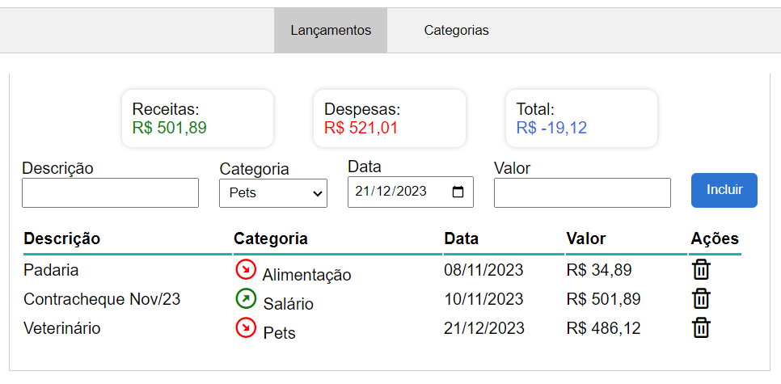
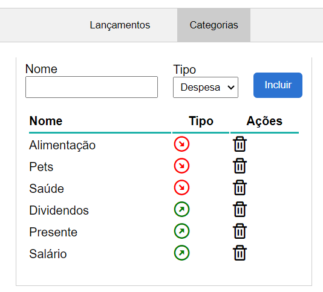

#  Finanças Web App Front-End

<!-- Sobre o projeto -->

## Sobre o projeto

O objetivo deste projeto é auxiliar no acompanhamento básico das finanças pessoais do usuário. O aplicativo possibilita a inclusão, remoção e listagem de receitas e despesas, mostrando um resumo do total das receitas e das despesas, junto com um saldo final.

Este projeto fez parte do MVP da Sprint 1 da Pós-Graduação da PUC-RJ.

### 🛠️Tecnologias

<ul>
  <li><strong>HTML</strong></li>
  <li><strong>CSS</strong></li>
  <li><strong>JavaScript</strong></li>
</ul>

## Instruções de Uso

Para usar este aplicativo, basta abrir o arquivo index.html no seu browser preferido. Nenhuma configuração adicional ou
instalação são necessárias.

### Instalação

1. Clone do repositório

```sh
   git clone git@github.com:marcelo-monte/puc-rj-mvp-sprint1-frontend.git
   cd puc-rj-mvp-sprint1-frontend
```

2. Abra o index.html no seu browser.

## Exemplos de Uso

- Layout da lista de lançamentos, com o resumo.
<div align="center">
  
</div>
<br>

- Layout da lista de categorias.
<div align="center">
  
</div>
<br>

## Desenvolvedor

- [Github](https://github.com/marcelo-monte)
- [Linkedin](https://www.linkedin.com/in/marcelo-monte-fernandes/)